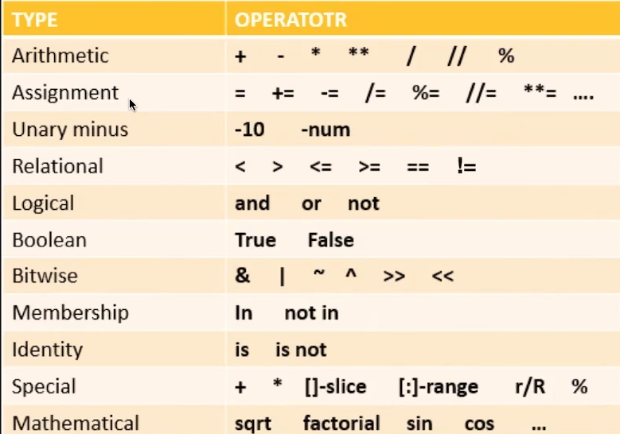
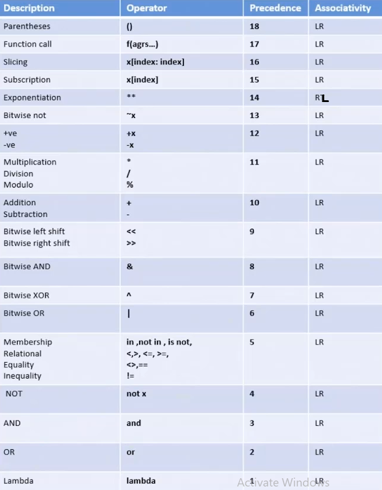
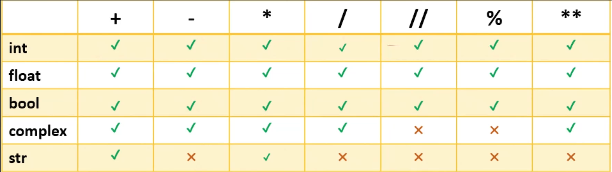

# Section Introduction
Python has a lot of operators. In this section we focus on:  
Arithmetic Operators  

We will also learn how to frame Expressions. We will also learn:   
Operator Precedence.  

# Arithmetic Operators
Python is rich in operators.  
List of all python opertors:  


List of Arithmetic Operators:
- \+
- \-
- \*
- **
- /
- //
- %

New object is created and variable points to it in memory.  

# Expressions
Instructions written using operators are called expressions.  
c = a + b -> This is an expression. =, + are operators and c, a, b are operands.  

Operators in an expression are evaluated according to their precedence:  


Same precedence operators are evaluated according to their associativity.  
All are LR except ** which is RL.  

# Math module
```python
import math

r = 10
area = math.pi * r * r

print(area)
```


math.pi
math.sqrt()

# Arithmetic Assignment Operators
Arithmetic operators joined with assignment operator.  
~[Assignment Operators](Assignment_operators.png)

List of arithmetic assignment operators:
- =
- \+=
- \-=
- \*=
- **=
- /=
- //=
- %=

List of assignment bitwise operators:
- &= - and
- |= - or
- ~= - not
- ^= - xor
- \>>= - right-shift
- <<= - left-shift

# Arithmetic with all datatypes
Refer the following:  


