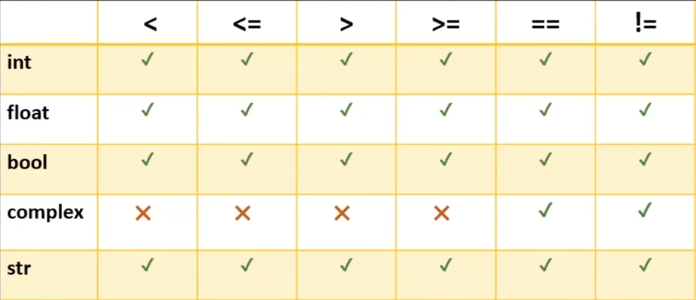
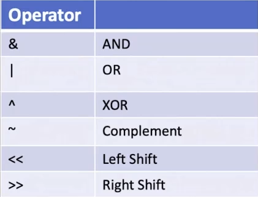

# Section Introduction
In this section:
1. Relational operators
1. if...elif...else
1. Logical operators
1. Bitwise operators
1. Membership operators

# Conditional Statements - if, else, elif
```python
if condition:
    statement 1
    statement 2
else:
    statement 1
    statement 2
```

For writing the `conditions` we need to use `relational` and `logical` operators.  

Relational (comparison) operators:
- <
- <=
- \>
- \>=
- ==
- !=

Logical operators:
- and
- or
- not

The result of these operators is always a boolean.  

# Logical Operators
These are useful for compound conditional statements.  

and, or, not

# Nested ifs
**Remember** `elif` is just a fancy way of expressing `else: if`.  

Using multiple ifs will lead to each condition being evaluated, whereas, elif will skip all the conditions following it. This makes elifs more efficient.

# Detail Relational Operators


Relational operators for Strings:  
<, >, <=, >=  - compares lexicographical order of the strings.  
== - checks if both of them are the same.  

**Note:** They actually compare the Unicode values.

# Detail Logical Operators
Types of logical operators:
1. Non-bool type
1. Short circuit

Usually `and`, `or`, `not` are used with boolean values.  
But can be used with non-bool type of data also.  

Any non-zero value is treated as True. 0 is False.
```python
if 5 and 6:
    This will be executed.
```

Actually `5 and 6` will give 6 not True.  
It will give the second number.  

Now consider the following:
```python
if 5 or 6:
    This will be executed
```

Here, `5 or 6` will give 5.  

**Note:** `and` and `or` will return the last value they check. This is short-circuiting.  

**Note:** 0, 0.0, 0+0j, "" are all treated as False.

# Bitwise Operators


These operators work on `int` type of data.  
They perform operations on binary representation of data, i.e. the actual representation in the memory.  

To find the binary notation of a number use:  
`format(a, 'b')`  
This returns a string. '1010'.  
'b' here stands for binary.  

bin(a) does the same thing but it will show as a literal. That is '0b1010'.  

To find the length of binary notation, that is the number of bits used:  
`a.bit_length()`  

We can do this for any variable.  


Example:
```python
a = 10 # 1010
b = 13 # 1101
a & b
```
Result: 1000  

It does the and operation for each bit.  

For << and extra 0 is added at the right end.  
Therefore left shift is equivalent to * 2.  
a << 2 = 4 * a  

In python there is bit overflow like in C.  

For >> the number becomes half. Always.  
It is actually equivalent to integer division by 2.

# Identity operators: is - is not
If two variables are referring to same data then the result of `is` will be True.  

If we do:  
a = 10. Then value 10 is stored in memory and a refers to it.  
If we also do:  
b = 10. As the same literal value is used, memory for it is not created again. Rather b points to the same memory 10.  

Now when we do `a is b`, then it asks "are they same? are a and b referring to the same data".  

**Note:** is and is not do NOT compare the values, they compare whether they point to the memory location.  

`id(a)` - will give us the memory location of a.  


Now consider the following scenario.  
a = 10 and also b = 10. But the 10's are stored in different memory locations.  
Then a is b will result in False, as they both do not point to the same memory location.  

Q. How can this happen?
```python
a = 10
b = 10
# Here a and b refer to the same memory.
```

